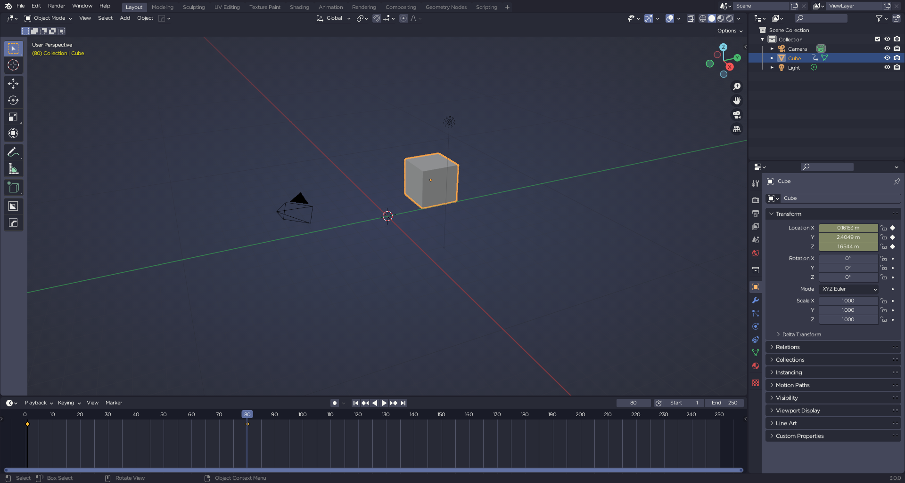

# Dracula for [Blender](https://www.blender.org)

> A dark theme for [Blender](https://www.blender.org).

## Install

All instructions can be found at [draculatheme.com/blender](https://draculatheme.com/blender).

## Team

This theme is maintained by the following person and a bunch of [awesome contributors](https://github.com/dracula/blender/contributors).

 |  |
|------------------------------------------------------------------------------------------------------------------------|------------------------------------------------------------------------------------------------------------------|
[Allie (ChildishGiant)](https://github.com/childishgiant)                                                                | [Low Polygon Design](https://github.com/lowpolygon-design)                                                       |

## License

[MIT License](./LICENSE)
